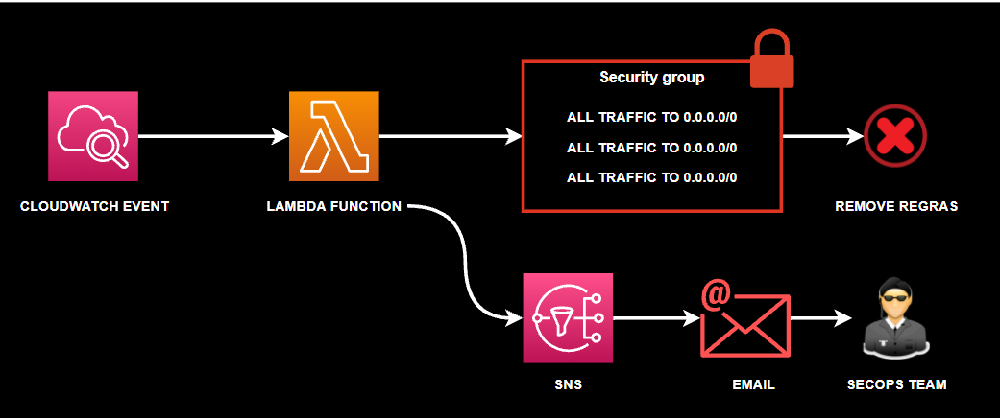

# Lambda Security Automation via Terraform



Esse é um projeto de um Módulo Terraform para deploy de funções Lambdas através de gatilhos do Cloudwatch e envio de notificações via SNS

## Descriçao do Projeto
Esse projeto tem o objetivo de entregar no seu final uma função Lambda para automatizar o processo de correção de incidente de Segurança.
O incidente em questão trata-se da exposição de recursos através de grupos de Segurança com regras totalmente permissivas, por exemplo: all traffico to 0.0.0.0/0.
A função lamba executa de tempos em tempos no ambiente afim de localizar security groups vulneraveis, uma vez identificado, a função remove a regra do security group e informa via email o time/pessoal responsavel

## Motivadores
Manter o ambiente cloud seguro é um grande desafio. Automatizar processos, principalmente resposta a incidente de Segurança é um grande passo para os objetivos do time de Segurança.

## Cuidados
A função Lambda executa de tempos em tempos e faz alterações a nivel da conta AWS. Mapeie bem os impactos antes de usar.

# Notes
Esse módulo já cria a role necessária para a execução da Função Lambda
Não é necesssário habilitar nenhum recurso na console da AWS

## Requirements
- [aws cli](https://docs.aws.amazon.com/pt_br/cli/latest/userguide/cli-chap-install.html) | configuração de autenticação via profile do arquivo credentials
- [terraform](https://www.terraform.io/) | provisionamento dos recursos
- [função lambda](https://aws.amazon.com/pt/lambda/) | função lambda que irá executar no ambiente
- [boto3](https://boto3.amazonaws.com/v1/documentation/api/latest/index.html) | AWS boto3. Biblioteca necessária para interagir com os recursos da AWS via python.

Este repositório contém a função lambda que identifica e remove regras que expõe todo tráfego de rede através de Security Groups.

## Usage

### Exemplo Declaração Simples | main.tf

```hcl
provider "aws" {
  region  = "us-east-2"
  profile = "dev" 
  #esse atributo profile faz referencia ao arquivo credential do .aws
}

module "lambda_exposed_alltraffic" {
  source              = "./modules"
  function_name       = "rm_ingress_rule_alltraffic_exposed"
  filename            = "lambda_function.zip"
  source_code_hash    = filebase64sha256("lambda_function.zip")
  handler             = "lambda_function.lambda_handler"
  runtime             = "python3.8"
  timeout             = 59
  memory_size         = 128
  event_name          = "a_cada_hora"
  event_description   = "Dispara a cada 1hr"
  schedule_expression = "rate(59 minutes)"
  sns_name            = "SNSSecOps"
  sns_endpoint        = "iluiz.sousa@gmail.com"
}
```

## Providers

| Name | Version |
|------|---------|
| <a name="provider_aws"></a> [aws](#provider\_aws) | n/a |

## Modules

- AWS Lambda Functions

## Resources

| Name | Type |
|------|------|
| [aws_cloudwatch_event_rule.rate_minutes](https://registry.terraform.io/providers/hashicorp/aws/latest/docs/resources/cloudwatch_event_rule) | resource |
| [aws_cloudwatch_event_target.check_foo_every_five_minutes](https://registry.terraform.io/providers/hashicorp/aws/latest/docs/resources/cloudwatch_event_target) | resource |
| [aws_iam_role.iam_for_lambda](https://registry.terraform.io/providers/hashicorp/aws/latest/docs/resources/iam_role) | resource |
| [aws_iam_role_policy_attachment.cw-attach](https://registry.terraform.io/providers/hashicorp/aws/latest/docs/resources/iam_role_policy_attachment) | resource |
| [aws_iam_role_policy_attachment.ec2-attach](https://registry.terraform.io/providers/hashicorp/aws/latest/docs/resources/iam_role_policy_attachment) | resource |
| [aws_iam_role_policy_attachment.sns-attach](https://registry.terraform.io/providers/hashicorp/aws/latest/docs/resources/iam_role_policy_attachment) | resource |
| [aws_lambda_function.traffic_exposed](https://registry.terraform.io/providers/hashicorp/aws/latest/docs/resources/lambda_function) | resource |
| [aws_lambda_permission.allow_cloudwatch_to_call_lambda_check](https://registry.terraform.io/providers/hashicorp/aws/latest/docs/resources/lambda_permission) | resource |
| [aws_sns_topic.user_updates](https://registry.terraform.io/providers/hashicorp/aws/latest/docs/resources/sns_topic) | resource |
| [aws_sns_topic_subscription.user_updates_sqs_target](https://registry.terraform.io/providers/hashicorp/aws/latest/docs/resources/sns_topic_subscription) | resource |

## Inputs

| Name | Description | Type | Default | Required |
|------|-------------|------|---------|:--------:|
| <a name="input_event_description"></a> [event\_description](#input\_event\_description) | descrição do evento de trigger | `string` | n/a | yes |
| <a name="input_event_name"></a> [event\_name](#input\_event\_name) | Nome do cloudwatch event que servirá de gatilho para a função lambda | `string` | n/a | yes |
| <a name="input_filename"></a> [filename](#input\_filename) | caminho do arquivo/codigo da função lambda | `string` | n/a | yes |
| <a name="input_function_name"></a> [function\_name](#input\_function\_name) | nome da função lambda | `string` | n/a | yes |
| <a name="input_handler"></a> [handler](#input\_handler) | handler da função lambda | `string` | n/a | yes |
| <a name="input_memory_size"></a> [memory\_size](#input\_memory\_size) | memoria alocada para execução da função lambda | `string` | n/a | yes |
| <a name="input_runtime"></a> [runtime](#input\_runtime) | engine/linguagem que a função lambda é escrita/roda | `string` | n/a | yes |
| <a name="input_schedule_expression"></a> [schedule\_expression](#input\_schedule\_expression) | Intervalo de execução da função lambda | `string` | `""` | no |
| <a name="input_sns_endpoint"></a> [sns\_endpoint](#input\_sns\_endpoint) | email dos subscribers do topic sns | `string` | n/a | yes |
| <a name="input_sns_name"></a> [sns\_name](#input\_sns\_name) | Nome do topico SNS | `string` | n/a | yes |
| <a name="input_source_code_hash"></a> [source\_code\_hash](#input\_source\_code\_hash) | arquivo da função lambda compatada hasbase | `string` | n/a | yes |
| <a name="input_timeout"></a> [timeout](#input\_timeout) | tempo maximo de execução da função lambda em segundos | `string` | n/a | yes |

## Outputs

No outputs.

# To do
- Personalizar modulo para o user escolher quais recursos ele deseja deployar
- Separar os Recursos de Cloudwatch e SNS desse módulo e declara-los num módulo independente
- Alterar a trigger da função lambda para disparar mediante um alarme de detecção de alteração no Security Group.